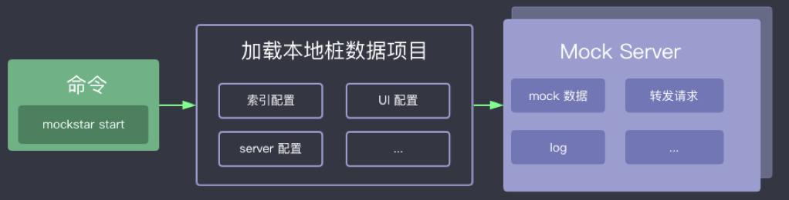
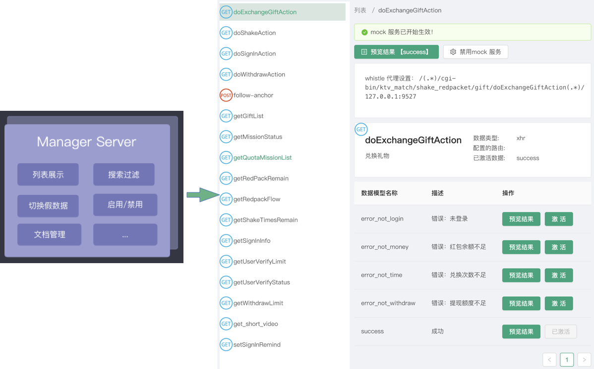
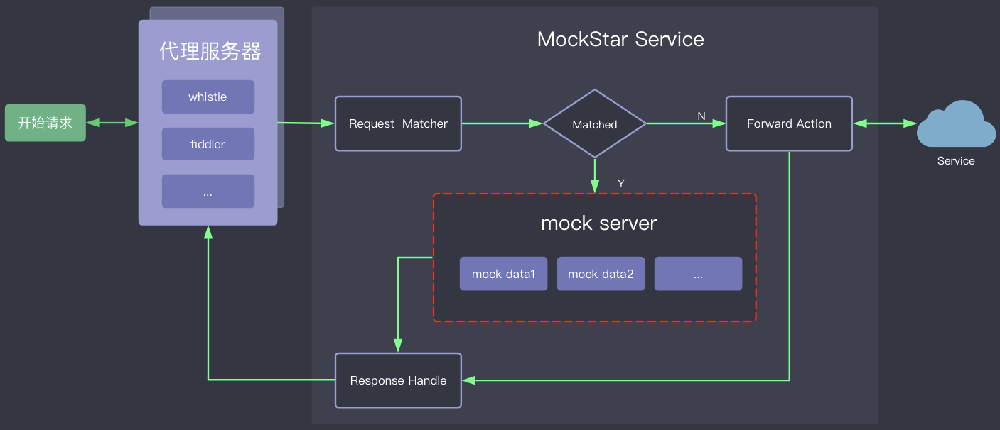
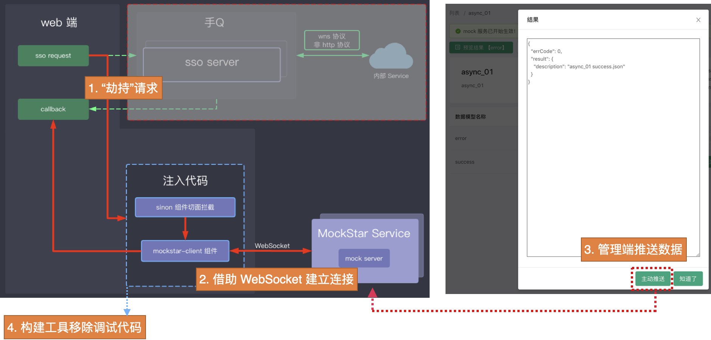

# MockStar 方案说明

## 1. 基本概念

我们一般说的"模拟数据"或者"假数据"，都是指为了某种目的而构造的数据。构造"假数据"来辅助开发的行为，我们称之为"数据打桩"，参考了 [桩 (计算机)](https://zh.wikipedia.org/wiki/桩_(计算机)) 的概念。因此"假数据"也可称为"桩数据"。

为了更好的表述，在 MockStar 中，我们有三个概念需要说明下：

- `Mocker`，即桩对象，例如一条接口我们称之为一个 `Mocker`
- `Mock Module`，即"桩数据"或"假数据"，例如接口包含的不同的结果，就有多个 `Mock Module`
- `Active Mock Module`，对于某个 `Mocker` 而言当前处于 `激活` 状态的 `Mock Module`

通常，一个 H5 项目里面可能会有多条接口（`Mocker`），而每条接口（`Mocker`）又可能会有返回多种结果（`Mock Module`），且接口每次只能够返回一种数据结果（`Active Mock Module`）。

## 2. 一个命令启动 Mock Server

MockStar 拥有比较少的 API，启动服务只需要一个命令即可，会自动按照约定的规则加载本地桩数据项目，生成一个 Mock Server 。

## 3. 独立的管理平台 Manager Server

启动 Mock Server 的同时，还会启动一个独立的管理平台 Manager Server，支持对不同的桩数据进行管理。

## 4. 基于 http 协议的传统 HXR 或 fetch 使用 MockStar

基于 `http` 协议的传统 `HXR` 或 `fetch` 使用 MockStar，有几个关键点：

- 需要借助一些代理工具，例如 whistle 或 fiddler，将真实请求转发到 MockStar Service 上
- 一旦接口命中了预定义的路由，则会获得该路由所属 Mocker 激活的 Mock Modules 桩数据（Mock 数据）
- 若未命中路由，则会透传到生产环境，并将结果返回

## 5. WebSocket 或者 JSBridge 回调等异步数据使用 MockStar

而对于 `WebSocket` 或 `JSBridge` 回调等异步数据使用 MockStar，则会复杂一些，有几个关键点：

- 由于无法通过代理方式，因此需要利用 [sinon.js](https://sinonjs.org/) 来"劫持"请求
- 对于 `WebSocket` 或 `JSBridge` 回调等异步数据，可能会多次请求多次触发，因此需要借助 `WebSocket` 来建立连接
- 有了 `WebSocket` 建立连接之后，就可以在管理端可以主动"推动数据"
- 最后再借助于构建工具移除调试代码

