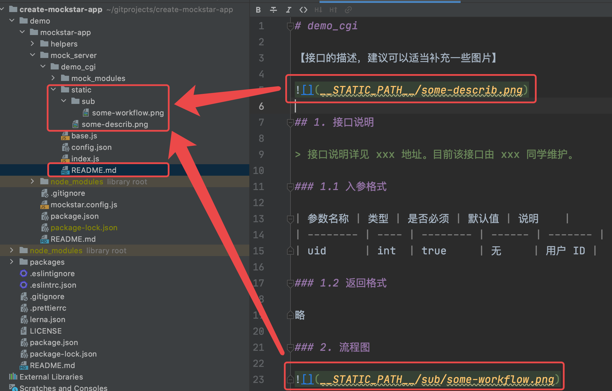

# 为 Mocker 写一份 README.md 文档

MockStar 提供了一个简单的机制，来支持为 Mocker 写一份 `README.md` 文档。

> MockStar 不强要求写 `README.md`，但为了更好的维护，我们推荐为 Mocker 写一份 `README.md` 文档。

## 1. 如何为 Mocker 增加 README.md 文档

### 1.1 与常规的 README.md 文档没什么不同

首先找到对应的 Mocker 目录（通常在 `mock_server` 目录下），然后增加一个名为 `README.md` 的文件。

我们引入了 [marked](https://www.npmjs.com/package/marked) 组件来解析 markdown 语法。大部分 markdown 语法它都是支持的，与常规的 README.md 文档没什么不同，你也可以通过他们的 [demo page](https://marked.js.org/demo/) 来试一试。


### 1.2 只有一个例外：引用本地图片等静态资源时需要特别处理

如果 `README.md` 文档中需要引入的本地图片等静态资源，则需要特别处理，基于如下约定：

- 必须要把本地图片等资源放置在各个 Mocker 目录的 `static` 文件夹内，与 `README.md` 同级，各个 Mocker 的 `static` 文件夹和 `README.md` 文件独立维护
- 引用本地图片时，需要通过 `__STATIC_PATH__` 这个变量来指代 `static` 的路径，引用非本地图片时没有这个限制

```
// 错误的写法，不能用这种相对路径


// 正确的写法，__STATIC_PATH__ 将会在渲染的时候自动替换 static 绝对路径

```

`static` 文件夹内是允许支持子目录的：

```
// 错误的写法，不能用这种相对路径


// 正确的写法，__STATIC_PATH__ 将会在渲染的时候自动替换 static 绝对路径

```

你也可以查看 [https://github.com/mockstarjs/create-mockstar-app/tree/master/demo/mockstar-app](https://github.com/mockstarjs/create-mockstar-app/tree/master/demo/mockstar-app) 这个 demo 来理解：




## 2. 怎么查看 README.md 文档内容

除了上述对于本地图片引用的特殊语法限制之外，其他的都可以用任意一款支持解析 markdown 语法的工具来查看内容。

你也可以直接启动 MockStar 服务，如果写了 `README.md` 文档的，则在操作管理端是可以看到内容的。


## 3. README.md 该写什么内容

由于 MockStar 主要做 Mock Server，并未涉及到接口协议的定义，因此，一般建议将接口定义相关的内容补充到 `README.md` 里面。或者将其他平台的地址填写在此处。

与其相关的开发、产品等人员，也可以进行备注，以便后续能找到对应的人。

除此之外，如果有一些特别要说明的，包括业务逻辑等，也应该进行备注。
