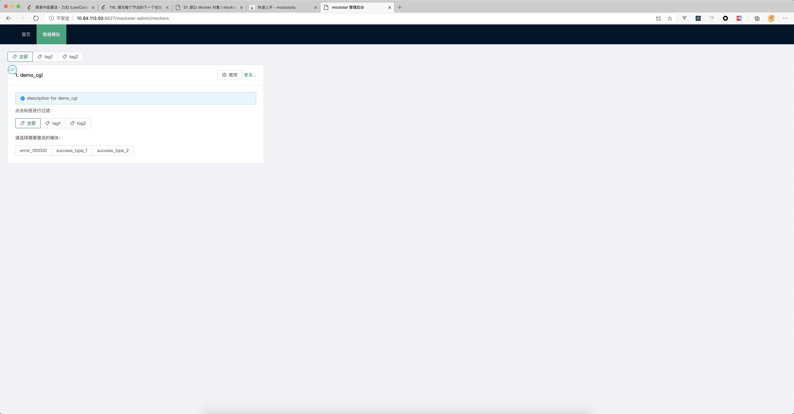
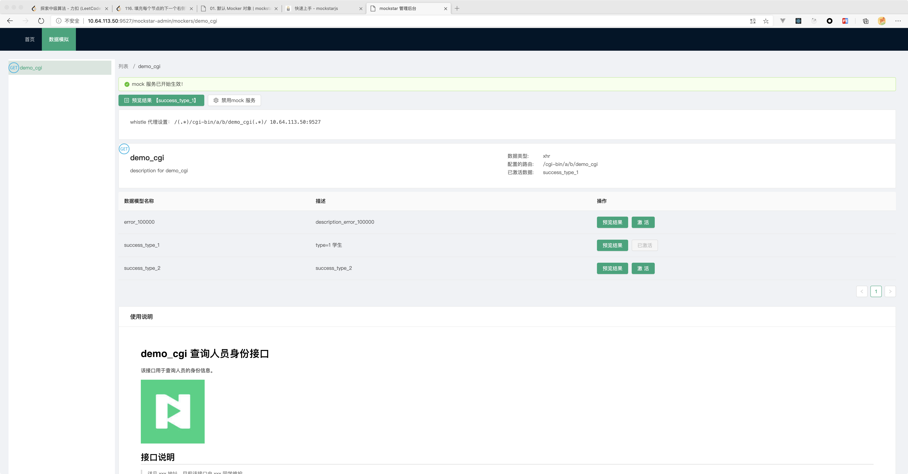
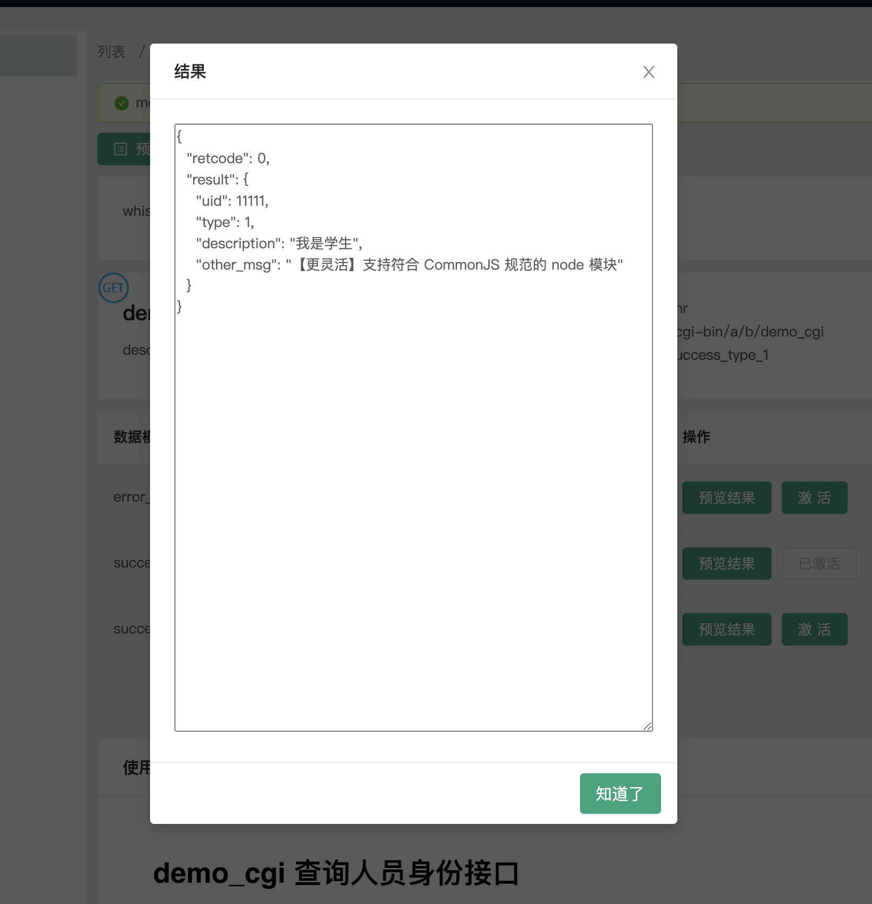
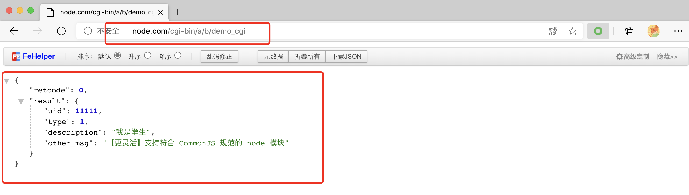
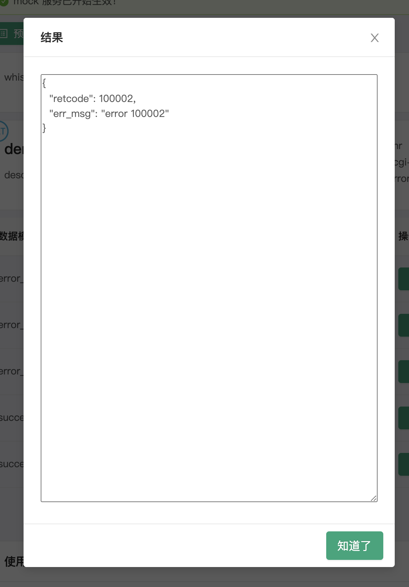

# 01. 默认 Mocker 对象

本节我们将实现：测试默认的 Mocker 对象，并添加一组 mock_module。

## 1. 启动项目

执行如下命令即完成项目的启动了：

```bash
$ npm start
# or
# 前提为全局安装了 mockstar-cli
$ mockstar start --watch
```


## 2. 打开管理端

> - 当使用了 `--watch` 之后，我们会监听 `mockServerPath` 值对应的目录文件变化，自动重启服务。
> - 需要注意的是目前我们并不会刷新页面，还是需要大家手动刷新

默认情况下，mock server 会使用 `9527` 端口，因此打开浏览器，访问 `127.0.0.1:9527`。你可以激活不同的桩数据，体验自由切换桩数据的功能。

脚手架中提供了几个 mocker 样例，你可以进入到 `mock_modules` 目录下，找到其中一个桩数据，适当修改返回值，然后再在管理端"预览结果"。管理端启动效果如下：



在这个界面我们可以看到展示了一个较为精简的 Mock 面板，同时提供快捷的接口数据切换。

点击 `更多` 后，显示一个更加详细的管理面板

- 渲染 Mocker 根目录下的 `README.md`，展示必要的信息
- 提供 `whistle` 配置，复制即可使用
- 提供结果预览功能，快捷的查看接口结果



## 3. 查看接口

### 3.1 在后台中查看



我们直接在后台中预览结果如上。

### 3.2 通过 whistle 代理后访问

> 具体的配置可以参考 [工具部分](/tool/)



通过代理，我们可以更加方便的实现本地的调试功能。

## 4. 添加一组数据

现在我们将要在这一 Mocker 下，添加两个 mock_module 即不同的接口返回数据。

### 4.1 JSON 方式

我们在 `src/mockers/demo_cgi/mock_modules`，下面新建 `error_100001.json`，并添加如下内容：

```json
{
  "retcode": 100001,
  "err_msg": "error 100001"
}
```

完成之后刷新管理后台，可以看到对应的 mock 数据已经被添加：


我们同样可以预览其结果：


### 4.2 JS 方式

通过 JS 方式的，新增数据类型时只需要默认暴露数据即可，我们在`src/mockers/demo_cgi/mock_modules`，下面新建 `error_100002.js`，并添加如下内容：

```js
module.exports = {
  retcode: 100002,
  err_msg: "error 100002",
};
```

同样可以预览结果：



### 4.3 添加配置

这一部分可以参考`src/mockers/demo_cgi/mock_modules/(success_type_1|error_100000)` 文件夹下面的内容，通过 `index.js` 默认暴露需要测试的数据，并且通过 `config.json` 进行不同类型数据的配置。

具体的配置详情可以 [参考](/api)。