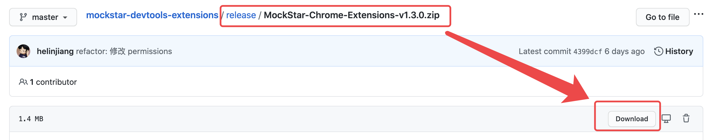
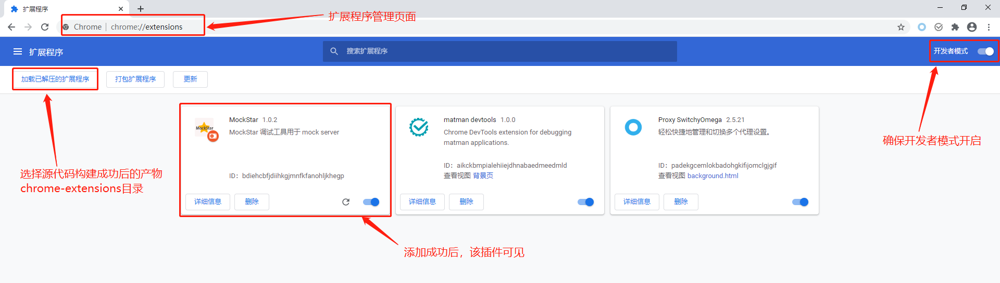
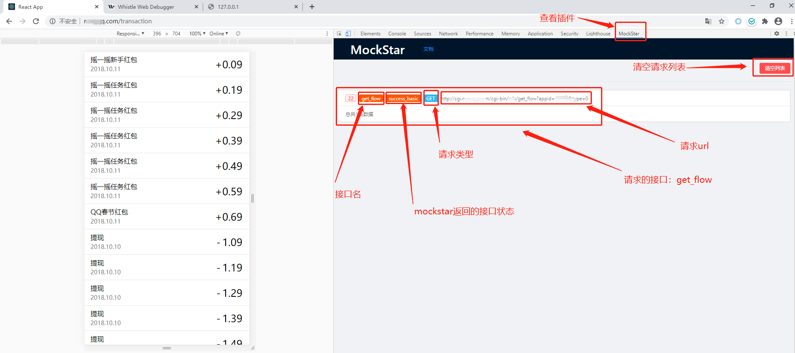
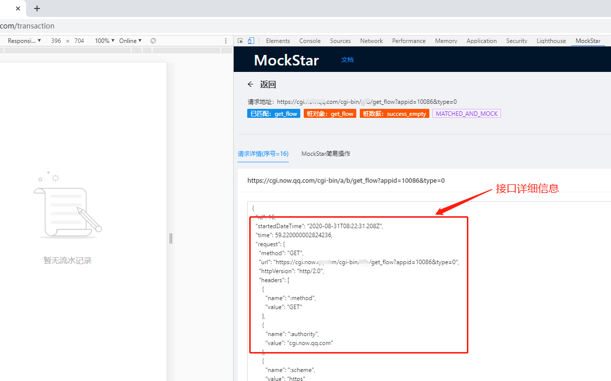
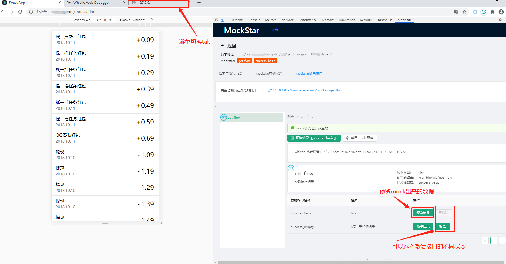
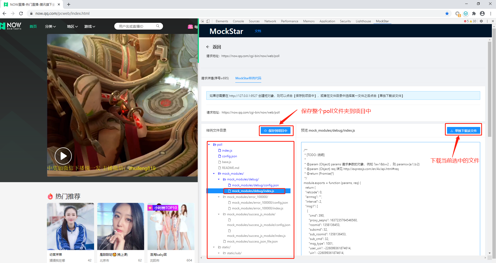

# Chrome 插件：MockStar Developer Tools

MockStar Developer Tools 是一个 Chrome 扩展插件 （Chrome DevTools extension），是为了让 MockStar 的使用变得更简单。配合本插件，可以极大提升开发效率。

> 如果还不熟悉 MockStar 框架，请参考： [MockStar 官方文档](https://mockstarjs.github.io/mockstar/)

## 1. 如何安装

### 1.1 chrome应用商店安装

> chrome 应用商店的版本有些问题，暂不建议使用，正在修复中...

您可以选择在 chrome 应用店安装插件，搜索 `MockStar` 或直接点击 [MockStar Developer Tools 扩展程序地址](https://chrome.google.com/webstore/detail/mockstar/ilobmcmmonneghpjpkcjgbbbmccnngfn?utm_source=chrome-ntp-icon) 进入安装。

### 1.2 源码安装

我们强烈推荐从源码安装，这样可以获得最新的最新的版本（Chrome 应用商店审核一般比较延迟）。打开 [https://github.com/mockstarjs/mockstar-devtools-extensions/tree/master/release](https://github.com/mockstarjs/mockstar-devtools-extensions/tree/master/release) ，可以看到压缩好的安装包（格式为 `MockStar-Chrome-Extensions-vx.x.x.zip`），点击进入，找到 `download` 按钮，即可将其下载到本地。



你也可以直接克隆仓库代码，在 `release` 目录下找到该文件。

```bash
$ git clone https://github.com/mockstarjs/mockstar-devtools-extensions
```

获得 `zip` 包之后，将该文件进行解压，可以看到一个 `chrome-extensions` 文件夹。

打开 Chrome 浏览器，在地址栏输入 [chrome://extensions/](chrome://extensions/)，开启右上角 `开发者模式`，既可以看到 `加载已解压的扩展程序` 按钮，点击它之后，，选中刚刚解压得到的`chrome-extensions` 文件夹。


<center>图一</center>

检查插件安装情况

- 确保图一中的插件已经存在插件列表
- 查看开发者工具中（F12）是否存在 `MockStar` (如果之前已经开启了开发者调试模式，则需要关闭再重新打开)


<center>图二</center>

如图二所示，能够看到 MockStar，表示已成功安装。

## 2. 快速使用

### 2.1 MockStar 请求列表



开启mockstar服务侦听后，插件会对请求进行过滤，经过的xhr和fetch都会被展示在请求列表中，静态资源等请求则会被过滤掉。

### 2.2 接口详情

点击列表中的具体接口，我们可以进入接口详情，这里展示请求的所有内容，包括请求头、请求参数、请求体以及返回的数据结果等，该模块使得到的请求结果可以直接被拷贝。



### 2.3 MockStar 简易操作

如果当前为mock接口，我们进入详情可以看到MockStar简易操作tab栏，对mock数据进行管理



### 2.4 MockStar 样例代码

当前接口如果不是mock的接口，进入详情页面，可以看到mockstar样例tab。



样例代码中的文件，我们可以选中下载单个文件，放到对应的文件夹下，完成数据的构造。此外，我们还可以保存完成的样例结构到项目中


`保存到项目中`之前，我们可以做一些简单配置调整。


## 3. FAQ

<b>1. 问：</b>为什么我的mockstar服务已经正常启动，且服务侦听也开启了，接口匹配不上，且详情页面看不到mockstar简易操作页面？

<b>答：</b>
    a) 检查当前的插件版本是否已经升级至 `v1.3.0` 或以上
    b) 检查 `mockstar` 和 `mockstar-cli` 版本是否为最新支持版本：
    mockstar: v1.3.7+
    mockstar-cli: v1.3.8+

<b>2. 问: </b> 插件接口列表为什么需要侦听mockstar服务是否开启？

<b>答: </b>因为保存mockstar样例代码到项目中，为了避开浏览器的安全策略，需要我们的mockstar服务是开启的。


<b>3. 问: </b> 为什么`保存到项目中`按钮为禁用状态？

<b>答: </b>请检查您的mockstar服务是否开启，或者确保您已经侦听mockstar服务成功了。
