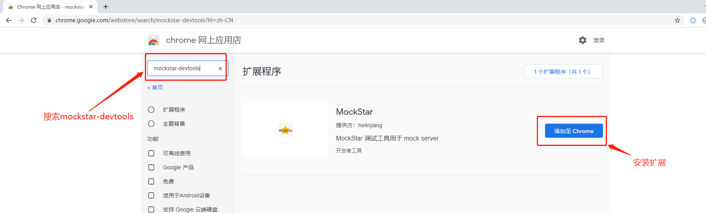

# mockstar-devtools-extensions

## 简介
mockstar-devtools-extensions（以下简称插件）是一个使mockstar的使用变得简单的浏览器插件。

项目中如果使用mockstar框架做mock层，那么该插件可以为你提升开发速度，减少页面切换频率。

如果还不熟悉mockstar框架，请参考： [mockstar指南](https://mockstarjs.github.io/mockstar/wiki/ )

## 安装

### chrome应用商店安装

您可以选择在chrome应用店安装插件


### 源码安装

github仓库：https://github.com/mockstarjs/mockstar-devtools-extensions

克隆仓库代码
```bash
$ git clone https://github.com/mockstarjs/mockstar-devtools-extensions
```

安装项目依赖
```bash
$ cd mockstar-devtools-extensions
$ npm install
```

构建插件

```bash
$ npm run build:chrome；
```
此时，您将得到构建产物：chrome-extensions

加载构建好的插件到浏览器

- 打开浏览器扩展程序，开启右上角开发者模式，加载已解压的扩展程序，选中刚刚生成的chrome-extensions目录


<center>图一</center>

检查插件安装情况
- 确保图一中的插件已经存在插件列表；
- 查看开发者工具中（F12）是否存在mockstar。


<center>图二</center>

如图二所示，能够看到mockstar，表示已成功安装。

## 快速使用

### Mockstar请求列表


开启mockstar服务侦听后，插件会对请求进行过滤，经过的xhr和fetch都会被展示在请求列表中，静态资源等请求则会被过滤掉。

### 接口详情

点击列表中的具体接口，我们可以进入接口详情，这里展示请求的所有内容，包括请求头、请求参数、请求体以及返回的数据结果等，该模块使得到的请求结果可以直接被拷贝。


### mockstar简易操作

如果当前为mock接口，我们进入详情可以看到MockStar简易操作tab栏，对mock数据进行管理


### mockstar样例代码

当前接口如果不是mock的接口，进入详情页面，可以看到mockstar样例tab。


样例代码中的文件，我们可以选中下载单个文件，放到对应的文件夹下，完成数据的构造。此外，我们还可以保存完成的样例结构到项目中


`保存到项目中`之前，我们可以做一些简单配置调整。


## FAQ

<b>1. 问：</b>为什么我的mockstar服务已经正常启动，且服务侦听也开启了，接口匹配不上，且详情页面看不到mockstar简易操作页面？

<b>答：</b>
    a) 检查当前的插件版本是否已经升级至v1.3.0
    b) 检查mockstar和mockstar-cli版本是否为最新支持版本：
    mockstar: v1.3.7+
    mockstar-cli: v1.3.8+

<b>2. 问: </b> 插件接口列表为什么需要侦听mockstar服务是否开启？

<b>答: </b>因为保存mockstar样例代码到项目中，为了避开浏览器的安全策略，需要我们的mockstar服务是开启的。


<b>3. 问: </b> 为什么`保存到项目中`按钮为禁用状态？

<b>答: </b>请检查您的mockstar服务是否开启，或者确保您已经侦听mockstar服务成功了。
